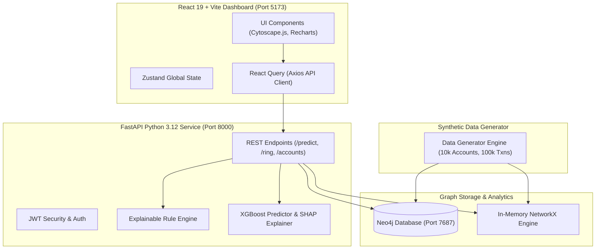

# System Architecture & Graph Schema Documentation

## 1. High-Level Architecture Diagram

---

## 2. Neo4j Graph Database Schema

### Node Label: `Account`
Properties:
- `account_id` (STRING, UNIQUE INDEX)
- `opened_date` (STRING ISO-8601)
- `balance` (FLOAT)
- `account_type` (STRING: "SAVINGS", "CURRENT", "SALARY", "DIGITAL")
- `kyc_status` (STRING: "VERIFIED", "PENDING", "PARTIAL")
- `risk_score` (FLOAT: 0.0 to 1.0)
- `is_dormant` (BOOLEAN)

### Relationship Type: `TRANSFERRED`
Directed Edge: `(:Account)-[:TRANSFERRED]->(:Account)`
Properties:
- `transaction_id` (STRING)
- `amount` (FLOAT)
- `timestamp` (STRING ISO-8601)
- `channel` (STRING: "UPI", "NET_BANKING", "IMPS", "NEFT", "ATM")
- `location` (STRING)

---

## 3. Mule Ring Detection Flow

1. **Synthetic Data Generation**: Injects realistic multi-hop laundering chains (Dormant >180d $\rightarrow$ Sudden Credit $\rightarrow$ Rapid Forward 95% $\rightarrow$ Intermediate Hops $\rightarrow$ Cash Out).
2. **Graph Topological Feature Extraction**: Computes In/Out Degree, PageRank, Betweenness Centrality, Closeness Centrality, Hop Distance, and Forwarding Ratios.
3. **Hybrid Risk Engine**: Evaluates 10+ explicit fraud signatures in the Rule Engine and combines them with XGBoost ML probabilities & SHAP feature importances.
4. **Interactive Dashboard**: Visualizes flagged rings in Cytoscape.js with step-by-step money flow sequence animations.
